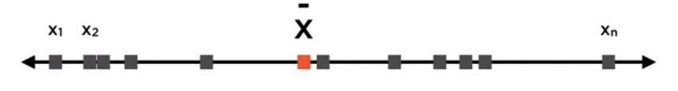
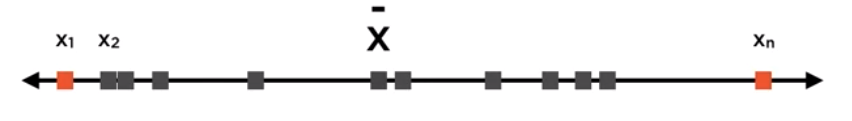
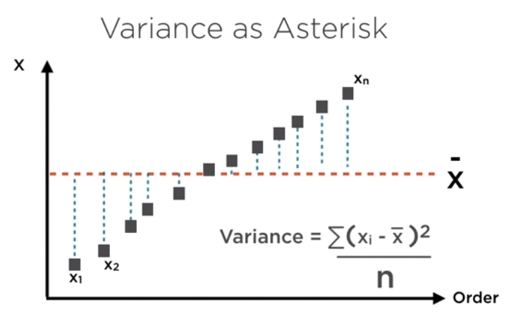
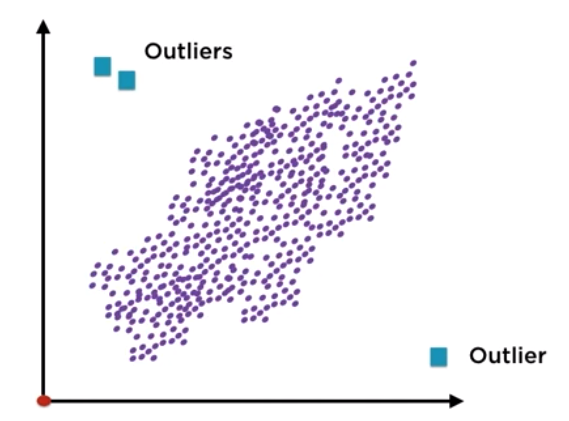

# Representing, Processing and Preparing Data
Course notes from PluralSight  
Start date: Aug 11th 2019

<!-- TOC -->

- [Representing, Processing and Preparing Data](#representing-processing-and-preparing-data)
- [Understanding cleaning techniques](#understanding-cleaning-techniques)
    - [Common issues with data:](#common-issues-with-data)
    - [Choices of Technology](#choices-of-technology)
    - [Missing data](#missing-data)
    - [Outliers](#outliers)
        - [Distance from the mean](#distance-from-the-mean)
        - [Distance from fitted line](#distance-from-fitted-line)

<!-- /TOC -->

# Understanding cleaning techniques
* Descriptive statistics: identify important elements in a dataset. Needs to work in conjunction with...
* Inferential statistics: explain relationships between data elements

*Find and connect the dots between elements in a dataset.*

## Common issues with data:
1. missing values
1. outliers: genuine || erroneously measured

## Choices of Technology

## Missing data
Options when data is missing:
1. **Delete** the record. Simple but can lead to bias (in the case missing values are not random). Can reduce sample size.
1. **Imputation:** replace it for something else. Statistics technique. Simple method: average, interpolate, build prediction models (e.g. regression - strenghtens correlation), LOCF (Last Observation Carried Forward - weakens correlation).

## Outliers
Identifying them:
* Distance from mean
* Distance from fitted line

Coping with them:
* Drop
* Cap/Floor
* Set to mean

### Distance from the mean
**Mean**: It is the one number that best represents all your datapoints.  
**Variation**: Do the numbers jump around? Range ignores the mean, and is swayed by outliers. Variance comes to the rescue!

  
  

Replacing the denominator on variance by `n-1` is called **Bessel's Correction**. It improves the estimate of the variance.

Outliers: points that lie more than *3 standard deviations (sqrt(variance))* from the mean.

### Distance from fitted line

