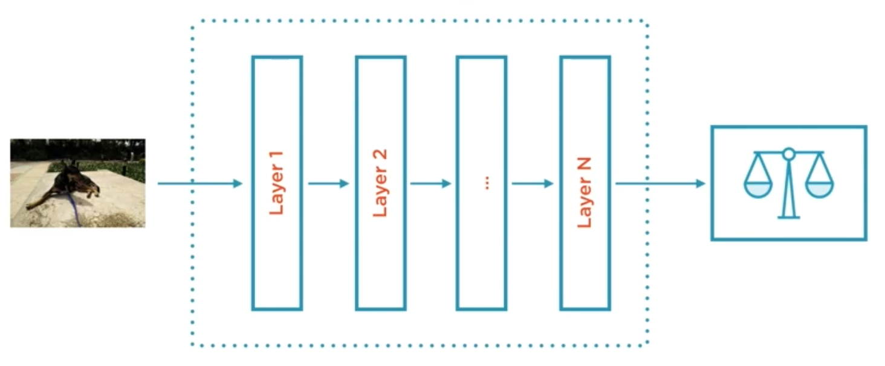
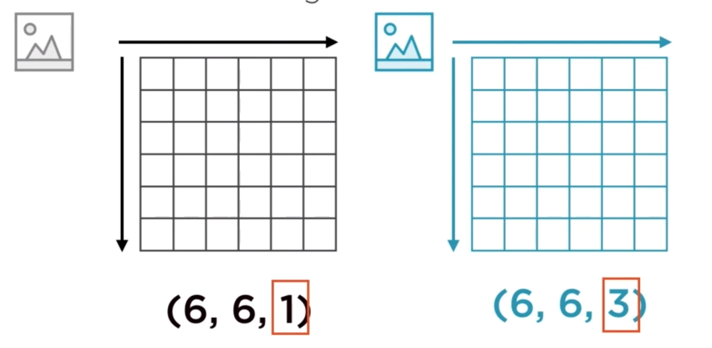

# Building Features from Image Data
Course notes from PluralSight  
Instructor: Janani Ravi  
Start date: Aug 24th 2019

<!-- TOC -->

- [Building Features from Image Data](#building-features-from-image-data)
- [Course outline](#course-outline)
- [Representing Images as Features for ML](#representing-images-as-features-for-ml)
    - [Images as Tensors](#images-as-tensors)
    - [Image Pre-Processing](#image-pre-processing)
    - [Images as arrays](#images-as-arrays)
        - [Common python package imports and operations](#common-python-package-imports-and-operations)
    - [Accessing individual color channels](#accessing-individual-color-channels)
    - [Image augmentation](#image-augmentation)
    - [Feature detection algorithms](#feature-detection-algorithms)
- [Dimensionality reduction techniques for image pre-processing](#dimensionality-reduction-techniques-for-image-pre-processing)

<!-- /TOC -->

# Course outline
* images as features
* detecting features and text
* dimensionality reduction

# Representing Images as Features for ML
* in the human brain, each neuron has its own specialization, reacting to portions of the image that are in its perceptive field.
* some neurons react to more complex patterns, which are a combination of lower level patterns. This is a classical neural network problem:


*Convolutional Neural Networks (CNNs) mimic the visual cortex and perceive images in 2 dimensions*

* Images are made of pixels which form numerical matrices.
    - RGB: values from 0-255 for each pixel:
        - 255-0-0: red
        - 0-255-0: green
        - 0-0-255: blue
    - Grayscale: pixel = intensity value: 0.0-1.0

## Images as Tensors



Machine learning frameworks (like TensorFlow) usually represent lists of images as 4-D tensors: (10, 6, 6, 3)
* 10 images
* 6 x 6 = height vs. width
* 3 channels

## Image Pre-Processing
|Common techniques|
|-|
|**Uniform aspect ratio**: central crop images to keep in the same proportion|
|**Uniform image size**: keep all images with the same HxW. Make them fit to CNN feature map. Downscale or Upscale|
|**Mean and perturbed images**: mean image = average pixel across the entire training set. Perturbed image: intentionally distort pixels by varying from mean image. It prevents CNN from focusing on the center of the image only.|
|**Normalized image inputs**: ensure each pixel has similar data distribution. You basically normalize each pixel. Subtract mean and divide by standard deviation. This speeds up your CNN.|
|**Dimensionality reduction**: going from RGB (3 channels) to grayscale (1 channel) for example. It is about reducing complexity while maintining your data meaningful to also speed up the training process.|
|**Data augmentation**: scale, rotate, affine transform. Reduces the risk of overfitting.|
|**Whitening**: transformation of the data such that the covariance matrix is the identity matrix - decorrelates the features of images.|

## Images as arrays
Open source library with a collection of algorithms and images: https://scikit-image.org  
`pip install -U scikit-image`  
in Jupyter: `!pip install -U scikit-image`

### Common python package imports and operations
```python
import skimage
from skimage import io

import numpy as np
import math

import matplotlib
import matplotlib.pyplot as plt

# Create a random array
random_image = np.random.random([500, 500])

# Plot it as image
plt.figure(figsize = (10, 10))
plt.imshow(random_image, cmap='gray')
plt.axis('off')
plt.colorbar();

# Images from scikit-image
from skimage import data
camera = data.camera() #image from a dude on a camera
#Checking metadata and image
print('Type: ', type(camera))
print('dtype: ' camera.dtype)
print('shape: ' camera.shape)
print('size: ' camera.size)
plt.figure(figsize=(10,10))
plt.imshow(camera, cmap='gray')

# Reading from file
chessboard = io.read('datasets/images/chessboard.jpg')
# Processing image pixels
chessboard[:, 250:510] = [0, 255, 0] # set these to green
chessboard[1290:1530, 1020:1310, :] = [255, 255, 255] # set to white
```

## Accessing individual color channels
```python
image = io.imread('some_image.jpg')
r = image[:,:,0]
g = image[:,:,1]
b = image[:,:,2]

# Plotting it all
f, axes = plt.subplots(1, 4, figsize(16,5))

for ax in axes:
    ax.axis('off')

ax_r, ax_g, ax_b, ax_color = axes
ax_r.imshow(r, cmap='gray')
ax_r.set_title('red channel')

ax_g.imshow(r, cmap='gray')
ax_g.set_title('green channel')

ax_b.imshow(r, cmap='gray')
ax_b.set_title('blue channel')

ax_color.imshow(np.stack([r,g,b], axis=2))
ax_color.set_title('all channels')
```

## Image augmentation
`pip install opencv-python` # developed by Intel  
`pip install albumentations` # wrapper around numpy, opencv, imgaug etc

```python
import cv2
import albumentations as albu
```

## Feature detection algorithms
* SIFT (Scale Invariant Feature Transformation) `pip install opencv-contrib-python`
* DAISY (faster and less error prone SIFT): `from skimage.feature import daisy`
* Histogram of Gradients (HOG): `from skimage.feature import hog`

# Dimensionality reduction techniques for image pre-processing
* Dictionary learning: finds a sparse representation. `from sklearn.decomposition import DictionaryLearning`
* Feature detection using convolutional layers (Convolutional Kernels). Convolution: sliding windows applied to a matrix. Outputs a feature map. Works like a specialized neuron that fires on a specific feature. `pip install tensorflow`. `import tensorflow as tf`. You provide multiple kernels depending on the feeatures you wish to extract (horizontal, vertical lines, edges etc).
* Autoencoders: unsupervised neural networks. It's a NN that uses its own input as an output to "learn": `x = f(x)`. Use it in pythonby installing `keras` and `tensorflow`.


