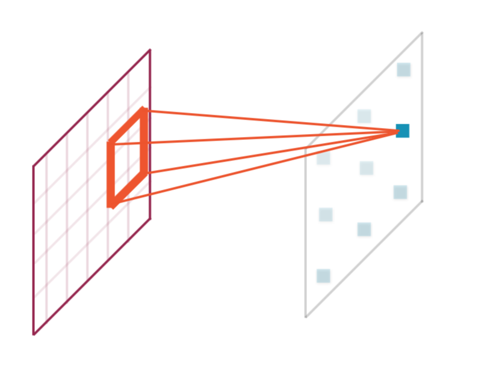
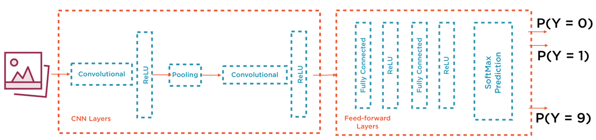

# Image Classification with PyTorch

<!-- TOC -->

- [Image Classification with PyTorch](#image-classification-with-pytorch)
- [1 Pre-processing methods](#1-pre-processing-methods)
- [2 Issues with Deep Learning](#2-issues-with-deep-learning)
- [3 Convolutional Neural Networks](#3-convolutional-neural-networks)
    - [Layers of a CNN](#layers-of-a-cnn)
    - [Convolution to Feature Map](#convolution-to-feature-map)
    - [Typical CNN Architecture](#typical-cnn-architecture)

<!-- /TOC -->

# 1 Pre-processing methods
* uniform aspect ratio
* uniform image size
* mean and perturbed images
* normalize image inputs
* dimensionality reduction
* data augmentation

# 2 Issues with Deep Learning
Parameter explosion:
* 100x100px image = 10.000 input parameters
    - if layer 1 = 10.000 neurons = O(10^5*10^5)
    - aprox. 100 million parameters to train.

No feature extraction with local invariance

# 3 Convolutional Neural Networks
* convolutional layers: zoom on specific bits
* successive layers aggregate inputs into higher level features

PIXELS >> LINES >> EDGES >> OBJECT

## Layers of a CNN
2 Types:
* Convolution
* Pooling

| Convolution | Pooling |
|-|-|
|Local receptive field|Subsampling of inputs|
|a sliding window function (kernel/filter) applied to a matrix|applies aggregation function to all inputs (sum, max, average)|
|parameters: zero padding, kernel size, stride|addresses overfitting|
||adds local invariance|

## Convolution to Feature Map

Definition: *Feature maps as convolutional layers generated by applying a convolutional kernel to the input.*

Characteristics:
* small convolutional kernels are more efficient
* feature maps are sparse representations (not dense)
* all neurons ini a feature map have the same weights and biases.

## Typical CNN Architecture

