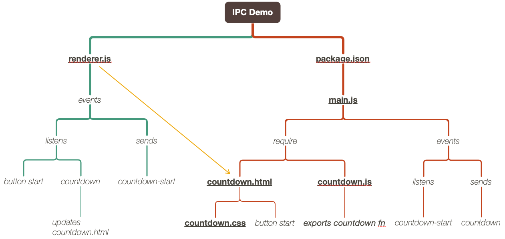

# Electron Fundamentals
Course notes from PluralSight  
Start date: Jul 20th 2019

<!-- TOC -->

- [Electron Fundamentals](#electron-fundamentals)
- [Intro](#intro)
    - [Sample Electron apps:](#sample-electron-apps)
    - [What can Electron do?](#what-can-electron-do)
- [Trying it out](#trying-it-out)
    - [Process Types](#process-types)
- [Experiment with Native API](#experiment-with-native-api)

<!-- /TOC -->

# Intro
* Made by GitHub
* Previously AtomShell
* Allows creation of cross-platform Desktop apps through the use of *HTML, CSS and JavaScript*.
* Bundles *Chromium and NodeJS*.
* Generates a native binary.
* Pre-requisites: Basic JavaScript, CSS, NodeJS.
* Allows re-use of web technologies to contruct desktop apps
* Destop rich features

## Sample Electron apps:
* VS Code
* Postman
* Atom
* Brave

## What can Electron do?
* Offers access to:
    - File system
    - Notifications
    - Network
    - Native menus
    - Fork and run processes
    - Offline by default
    - Runs as an native app
    - Full access to node and node native modules
    - No cross-browser concerns (target == Chrome)
    - No security sandbox (e.g.: CORS)
    - Another distribution channel

# Trying it out
`electron-prebuilt`, now simply `electron`, allows you to download an Electron specific for your OS (Mac, Windows or Linux).
```bash
$ npm init -y
$ npm install electron -D
```
Then change `package.json`:
```javascript
{
  "name": "ipc-demo",
  "version": "1.0.0",
  "description": "",
  "main": "src/main.js",
  "scripts": {
    "start": "electron ."
  },
  "keywords": [],
  "author": "",
  "license": "ISC",
  "devDependencies": {
    "electron": "^5.0.7"
  }
}
```
Launch your app with `npm start`

## Process Types
In Electron there are multiple processes running simultaneously. The main types are:
* Main
* Render (usually an UI window): That's what the user sees. It can also be another main process (backrground work)

**Inter-process communication (IPC):**
* Each process gets its own IPC, which is an instance of Node's event emitter.

Example flow:
* Render process capture user event (eg.: press of a button)
* Render process broadcasts *start*.
* Main process listens for it and sends *processing* to all of its childs.
* Render processes listening to it update accordingly.

|Main process|Render|
|-|-|
|-|<<< ipc.send('start')|
|ipc.on('start', fn) >>>|-|
|renderer.webContents.send('processing') >>>|-|
|-|ipc.on('processing', fn)|



[Code](ipc-demo)

# Experiment with Native API
* Electron allows us to experiment with the native OS API's
* These will be 5 projetcs:
  - Application menu
  - System tray
  - Clipboard
  - Screenshot
  - Git status (child process in the OS)

[Code](native-apis)
