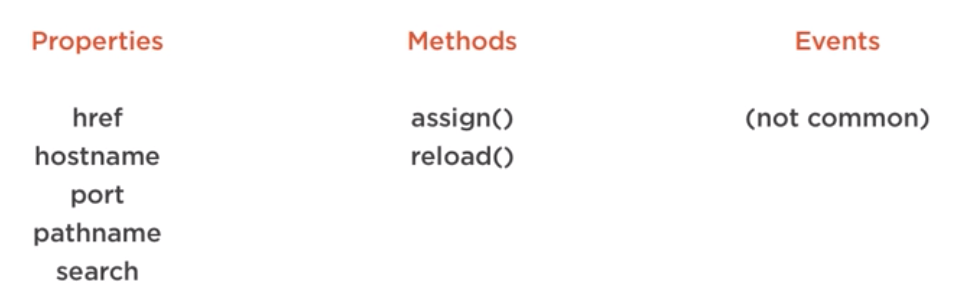
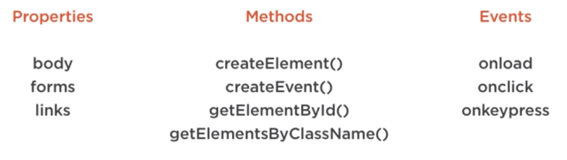

# JavaScript Fundamentals
Course notes from PluralSight  
Start date: Jul 28th 2019

<!-- TOC -->

- [JavaScript Fundamentals](#javascript-fundamentals)
- [Introduction](#introduction)
    - [Setup](#setup)
- [Language Features](#language-features)
    - [Constants](#constants)
    - [let and var](#let-and-var)
    - [Rest parameters](#rest-parameters)
    - [Destructuring Array](#destructuring-array)
    - [Destructuring Objects](#destructuring-objects)
    - [Spread Syntax](#spread-syntax)
    - [Common Type Conversions](#common-type-conversions)
    - [Controlling loops](#controlling-loops)
- [Operators](#operators)
    - [Conditional operator](#conditional-operator)
- [Functions and Scope](#functions-and-scope)
    - [Block scope](#block-scope)
    - [IIFE Pattern](#iife-pattern)
    - [Closures](#closures)
    - [this keyword](#this-keyword)
    - [call and apply](#call-and-apply)
    - [bind](#bind)
    - [Arrow Function](#arrow-function)
    - [Default parameters](#default-parameters)
- [Objects and Arrays](#objects-and-arrays)
    - [Constructor function](#constructor-function)
    - [Prototypes](#prototypes)
        - [Expanding objects using prototypes](#expanding-objects-using-prototypes)
    - [JSON](#json)
    - [Array iteration](#array-iteration)
- [Classes and Modules](#classes-and-modules)
    - [Constructor and Properties](#constructor-and-properties)
    - [Methods](#methods)
    - [Inheritance](#inheritance)
    - [Modules](#modules)
- [Programming the BOM and the DOM](#programming-the-bom-and-the-dom)
    - [The window Object](#the-window-object)
    - [Timers](#timers)
    - [Location](#location)
    - [DOM](#dom)

<!-- /TOC -->

# Introduction
* 1995 - JS created
* 1997 - ECMA Standard, ECMAScript
* 1999 - ECMAScript3 (ES3)
* 2009 - ES5
* 2015 - ES6
* \> 2015 - yearly updates
* Webpack - https://webpack.js.org - A module bundler.

## Setup
1. Clone from https://github.com/wbkd/webpack-starter
1. `npm install`
1. `npm start`

# Language Features
* Constants
* let and var
* Rest parameters
* Destructuring
* Spread Syntax
* typeof()
* Type conversions
* Controlling loops

## Constants
* Symbols that will not change across the program;
* Cannot be changed, only initialized.

## let and var
* *let* has block scoping, *var* does not.
* Try to use let most of the time.

## Rest parameters
* Allows a function to store multiple arguments in a single array.
```javascript
function sendCars(day, ...allCarIds) {
    carIds.forEach( id => console.log(id));
}
sendCars('Monday', 1, 2, 3);
```

## Destructuring Array
* Easily assign values from an array into variables
```javascript
let carIds = [1, 2, 3]
let [car1, car2, car3] = carIds
let [carx, ...remainingCars] = carIds
let [, ...remainingCars] = carIds // skips first element
```

## Destructuring Objects
```javascript
let car = {
    id: 5000, 
    style: 'convertible'
}
let {id, style} = car
```
## Spread Syntax
* Opposite of rest
```javascript
function startCars(car1, car2, car3) {
    console.log(car1, car2, car3)
}
let carIds = [100, 200, 400];
startCars(...carIds);
```

## Common Type Conversions
```javascript
foo.toString();

Number.parseInt('55');
Number.parseFloat('55.99')
Number.parseFloat('55.99ABC') // ignores the trailing ABC and successfully converts
```

## Controlling loops
* `break` forces exiting a loop
* `continue` skips to next iteration

# Operators
* Simple mathematical operators.
* JS attempts to do type conversion when using `==`.
* Best practice is to use `===` to override type conversion.
* Unary operators: `++1967` and `1967++`;
* Logical operators:
    - &&
    - ||
    - !
    - These can be used outside of a conditional statement:
```javascript
let userSettings = {name: 'Joe'}
let defaultSettings = {name: 'Default'}
console.log(userSettings || defaultSettings)
```
* careful when comparing strings. Uppercase letters come before lowercase letters.

## Conditional operator
```javascript
var result = (foo > 5) ? true : false
```

# Functions and Scope
* Function and Block Scope
* IIFE's
* Closures
* *this*
* Arrow functions

## Block scope
* Scoping is not just for funcitions. It also applies to code blocks inside `if` and `for` statements.

## IIFE Pattern
* Immediately Invoked Function Expression
```javascript
let app = ( function() {
    let carId = 123;
    console.log('in function')
    return {};
})();
```
* Its real value is when it is used as a closure.

## Closures
* When you want an executed function scope to hang around.

## this keyword
```javascript
let obj = {
    carId: 123,
    getId: function() {
        return this.carId;
    }
};
console.log(obj.getId()); // 123
```

## call and apply
* These can change the value of *this*.
```javascript
let obj = {
    carId: 123,
    getId: function() {
        return this.carId;
    }
};
let newCar = { carId: 456};
console.log(obj.getId.call(newCar)); //456
```
* In the above example, you call the getId function from *obj*, but you give it a new context for *this*, so *this.carId* actually refers to *newCar*.
* `apply` is similar to `call`, but you can give it an array of arguments:
```javascript
let o = {
    carId: 123,
    getId: function(prefix) {
        return prefix + this.carId;
    }
};

let newCar = {carId: 456};
console.log(o.getId.apply(newCar, ['ID: ']));
//ID: 456
```

## bind
* Copies an existing function and gives it a context.
```javascript
let obj = {
    carId: 123,
    getId: function() {
        return this.carId;
    }
};
let newCar = { carId: 456};
let newFn = obj.getId.bind(newCar);
console.log(newFn()); //456
```

## Arrow Function
* as of ES2015
* parameters => return values
* Arrow function do not have their own *this* value.
```javascript
let getId = () => 123;
console.log(getId()); //123

let getId = prefix => prefix + 123;
console.log(getId('ID :'))
// ID: 123

let getId = (prefix, suffix) => prefix + 123 + suffix;
console.log(getId('ID: ', '!')); //ID: 123!
//OR
let getId = (prefix, suffix) => {
    return prefix + 123 + suffix;
};
console.log(getId('ID: ', '!')); //ID: 123!
```

## Default parameters
* It is about giving a default value to a parameter in case it is not given in the function call.
```javascript
let trackCard = function(carId, city='NY'){
    console.log(`Tracking ${carId} in ${city}.`);
}
```

# Objects and Arrays
* Constructor Functions
* Prototypes

## Constructor function
* Used to instantiate new objects
* Primary way to create objects, before there were *classes* available in JavaScript.
```javascript
function Car(id) {
    this.carId = id
    this.start = function (){
        console.log('vrumm...')
    }
}
let car = new Car(123);
car.start();
```

## Prototypes
* in order to save functions from being re-created every time you instantiate an object for a contructor;
* Saves memory;
```javascript
function Car(id){
    this.carId = id;
}
Car.prototype.start = function(){
    console.log(`Start: ${this.carId}`);
}
let car = new Car(123);
car.start();
```

### Expanding objects using prototypes
```javascript
String.prototype.hello = function() {
    return this.toString() + 'hello';
}
console.log('foo'.hello()); // foo hello
```

## JSON
```javascript
//Convert to JSON
console.log(JSON.stringify(carIds))

// Parsing
let jsonIn = `
    [
        {"carId": 123},
        {"carId": 456}
    ]
`
let carIds = JSON.parse(jsonIn)
```

## Array iteration
```javascript
// iterating and filtering
let carIds = [
    {carId: 123, style: 'sedan'},
    {carId: 456, style: 'convertible'},
    {carId: 789, style: 'sedan'},
]
let convertibles = carIds.filter(
    car => car.style === 'convertible'
)
console.log(convertibles)
```
* Similar to the above, you can use `find` (to return first element that matches condition) and `every` (tests every element in the array)

# Classes and Modules 
* A new syntax to create constructors.
* Modules allow code organization. File that can be shared across other files.
```javascript
class Car {

}
let car = new Car()
console.log(car)
```

## Constructor and Properties
* A constructor is a routine that gets executed when instantiating an object of a class (just like Java).
```javascript
class Car {
    constructor(id){
        this.id = id
    }
}
let car = new Car(123)
console.log(car)
```

## Methods
* Functions that exist on an object
* No need for the *function* keyword.
```javascript
class Car {
    constructor(id){
        this.id = id
    }
    identify(suffix) {
        return `This car id ${id}`
    }
}
let car = new Car(123)
console.log(car.identify('!!!'))
```

## Inheritance
```javascript
class Vehicle {
    constructor() {
        this.type = 'car'
    }
    start() {
        return `Starting: ${this.type}`
    }
}

class Car extends Vehicle {
    constructor() {
        super(); // calls parent constructor
    }
    start() { //override
        return 'car start' + super.start(); // and accessing parent's start().
    }
}
let car = new.Car()
console.log(car.type)
```

## Modules
* Break up a class into individual files
* In a `car.js` file:
```javascript
class Car {
    constructor(id){
        this.id = id
    }
    identify(suffix) {
        return `This car id ${id}`
    }
}
```
* In an `index.js` file:
```javascript
import { Car } from './models/car.js'
```

# Programming the BOM and the DOM
* Browser Object Model (BOM)
* Document Object Model (DOM)
* Window object
* Timers
* Location

## The window Object
* global object in JavaScript


* access the Mozzila developer network for details on the window object

## Timers
* Fire asynchronously
```javascript
let timeoutId = setTimeout( function() {
    console.log('1 second passed')
}, 1000)

clearInterval(timeoutId) // stops the timer
```

## Location


## DOM

