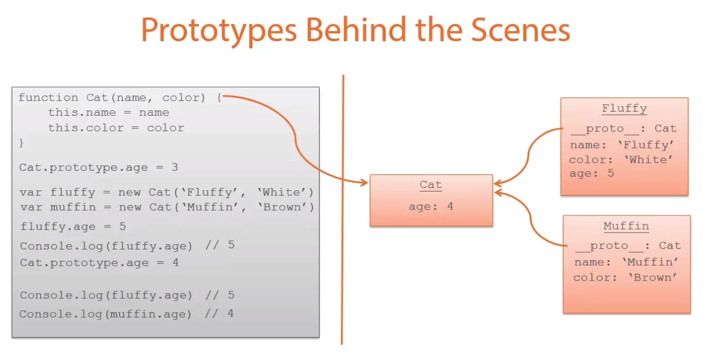
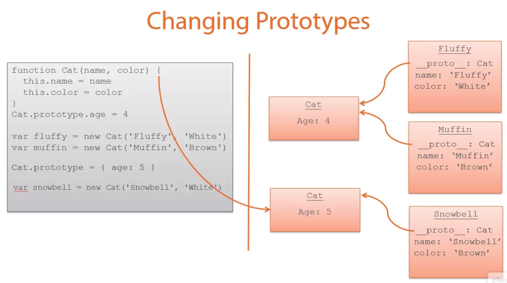

# JavaScript Objects and Prototypes
Course notes from PluralSight  
Start date: Aug 3rd 2019

<!-- TOC -->

- [JavaScript Objects and Prototypes](#javascript-objects-and-prototypes)
- [Creating JavaScript Objects](#creating-javascript-objects)
- [Object Properties](#object-properties)
    - [Getters and setters](#getters-and-setters)
- [Prototypes and Inheritance](#prototypes-and-inheritance)
    - [Changing Prototypes](#changing-prototypes)
    - [Creating your own prototype chain](#creating-your-own-prototype-chain)
    - [Creating prototype chain using classes](#creating-prototype-chain-using-classes)

<!-- /TOC -->

# Creating JavaScript Objects
* http://bit.ly/ObjAndProto
* The *this* keyword alter the value of the current object in JavaScript. If none is specified, it will refer to the `window` global object.
* There are multiple ways to create objects in JS. These are basically all syntetic sugar.
* JavaScript is dynamically typed, so you can add and change objects on the go.

Multiple ways to create objects:
```javascript
// Object literals
var cat = {name: 'Fluffy', color: 'White'}
display(cat.name)

// Constructor functions
function Cat() {
    this.name = 'Fluffy'
    this.color = 'White'
}
var cat = new Cat()
display(cat)

// ES6 Classes
class Cat {
    constructor(name, color) {
        this.name = name
        this.color = color
    }

    speak () {
        display('Meow')
    }
}

var cat = new Cat('Fluffy', 'White')
display(cat)
cat.speak()

// unsing Object.create
var cat = Object.create(Object.prototype,
    {
        name: {
            value: 'Fluffy',
            enumerable: true,
            writeable: true,
            configurable: true
        },
        color: {
            value: 'White',
            enumerable: true,
            writeable: true,
            configurable: true
        }
    }
)
```

# Object Properties
* Using \[brakets\] allows you to get and set property names for otherwise invalid values: e.g.: 
```javascript
'use strict'

var cat = {
    name: {first: 'Fluffy', last: 'LaBeouf'},
    color: 'White'
}

cat['Eye Color'] = 'Blue'

Object.defineProperty(cat, 'name', {writeable: false})
Object.freeze(cat.name) // prevent the whole object from being changed
Object.getOwnPropertyDescriptor(cat, 'name')

// Enumerable: making the enumerable property affects serialization of the the object
for (var prop in cat) {
    display(prop + ': ' + cat[prop])
}
Object.defineProperty(cat, 'name', {enumerable: false})

// Configurable - Prevents attributes from change or deletion
Object.defineProperty(cat, 'name', {configurable: false})
delete cat.name // throws error
```

## Getters and setters
* Allows you to define functions that run behind the scenes when working with setting and getting values from a property
```javascript
var cat = {
    name: {first: 'Fluffy', last: 'LaBeouf'},
    color: 'White'
}

Object.defineProperty(cat, 'fullName',
    {
        get: function(){
            return `${this.name.first} ${this.name.last}`
        }
        set: function (value){
            var nameParts = value.split(' ')
            this.name.first = nameParts[0]
            this.name.last = nameParts[1]
        }
    }
)

display(cat.fullName)
cat.fullName = 'Muffin Top'
```

# Prototypes and Inheritance
* A prototype is an object that exists in every function in JavaScript
* It's an empty object
* An object has an `undefined` prototype. Objects have a `__proto__`
```javascript
'use strict'

var arr = ['red', 'blue', 'green']
var arr = new Array('red', 'blue', 'green')

// Use array prototype to make the last function below available to any new array we create
Object.defineProperty(Array.prototype, 'last', {
    get: function (){
        return this[this.length-1]
    }
})
var last = arr.last
var arr2 = [1,2,3]
var last2 = arr2.last
```

* `Array` is an object of type *function Array() {[native code]}*.
* **A function's prototype:**  is the object **instance** that will become the prototype for all objects created using this function as a constructor.
* **An object's prototype:** is the object **instance** from which the object is inherited.
* A prototype is not like a class, it's actually an object.

Code explanation:
```javascript
function Cat(name, color){
    this.name=name
    this.color=color
}

Cat.prototype.age = 4 // sets an age property on all instances of this class

var fluffy = new Cat('Fluffy', 'White')
Cat.Prototype === fluffy.__proto__ // true. Both are the same object
var muffin = new Cat('Muffin', 'Brown')
fluffy.hasOwnProperty('age') // false since the object fluffy doesn't have an age directly, only its prototype class does.
```
* **Take away:** Just because JavaScript returns a value for some property, doesn't mean it was actually defined in it.
* JS checks properties in an object first, then in its prototype.



## Changing Prototypes
* This highlight prototypes are really objects that live in memory:


## Creating your own prototype chain
* Most important lines:
    - Animal.call(this, 'Meow')
    - Cat.prototype = Object.create(Animal.prototype)
    - Cat.prototype.contructor = Cat

```javascript
function Animal(voice){
    this.voice = voice || 'grunt'
}
Animal.prototype.speak = function() {
    console.log(this.voice)
}

function Cat(name, color){
    Animal.call(this, 'Meow') // calls the Animal function passing in the Cat being created
    this.name = name
    this.color = color
}

Cat.prototype = Object.create(Animal.prototype) // object.create does not execute the function, it just sets up the prototype chain
Cat.prototype.contructor = Cat // otherwise it will think fluffy was created from Animal before Cat.
var fluffy = new Cat('Fluffy', 'Cat')
fluffy.speak() // Meow
```

## Creating prototype chain using classes
* Same as the previous with different syntetic sugar
* *I like this one better!*
```javascript
class Animal{
    constructor(voice){
        this.voice = voice || 'grunt'
    }
    speak() {
        display(this.voice)
    }
}

class Cat extends Animal {
    constrictor(name, color){
        super('Meow')
        this.name = name
        this.color = color
    }
}

var fluffy = new Cat('Fluffy', 'White')
fluffy.speak()
```
