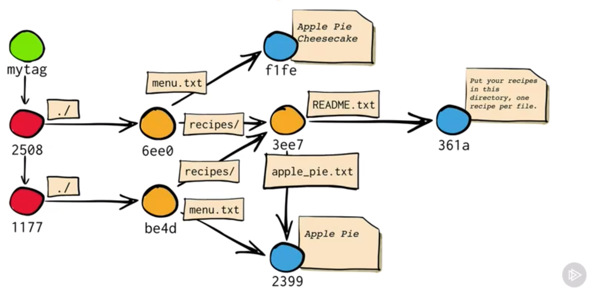
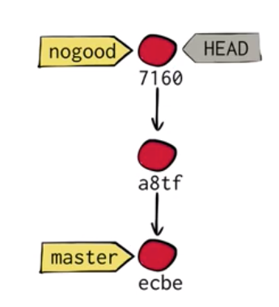
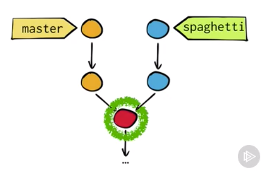
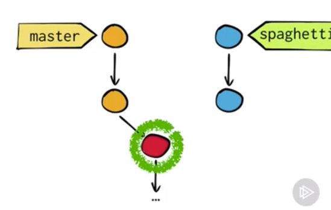
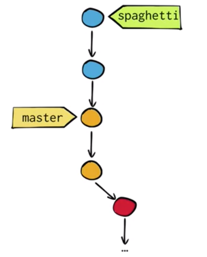
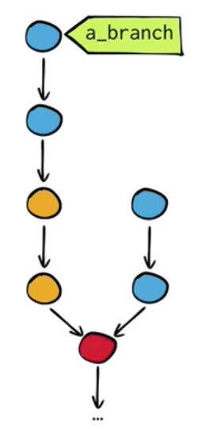
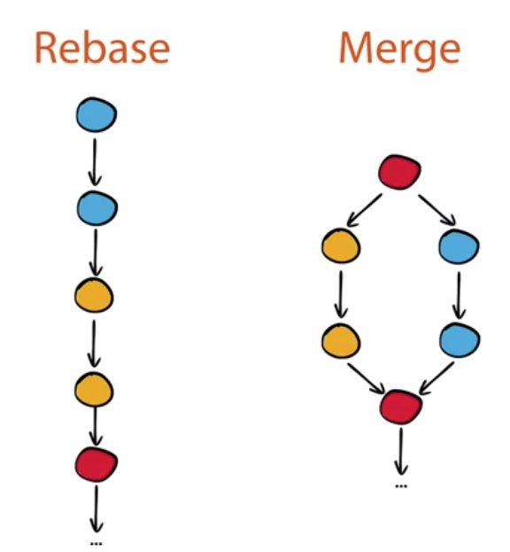

# How Git Works
Notes from PluralSight course by *Paolo Perrotta*.  
Start: Jul 25th 2019

*If you want to master Git, don't worry about learning the commands. Instead, learn the model.*

Porcelain Vs. Plumbing commands

<!-- TOC -->

- [How Git Works](#how-git-works)
- [It's not what you think](#its-not-what-you-think)
    - [Peel it off as an onion](#peel-it-off-as-an-onion)
    - [Values and Keys](#values-and-keys)
    - [Collision](#collision)
    - [A persistent map](#a-persistent-map)
    - [Git Objects](#git-objects)
    - [Versioning](#versioning)
    - [Annotated Tag](#annotated-tag)
- [Branches Demystified](#branches-demystified)
    - [What branches really are](#what-branches-really-are)
    - [Merges](#merges)
    - [Time Travel](#time-travel)
    - [Merging without Merging](#merging-without-merging)
    - [Losing your HEAD](#losing-your-head)
- [Rebasing](#rebasing)
    - [What does it look like](#what-does-it-look-like)
    - [Rebase Vs. Merge](#rebase-vs-merge)
        - [Merge trade-offs](#merge-trade-offs)
        - [Rebase trade-offs](#rebase-trade-offs)
    - [Tags in brief](#tags-in-brief)
- [Distributed Version Control](#distributed-version-control)
    - [Remotes](#remotes)
    - [Synchronizing remotes](#synchronizing-remotes)
    - [GitHub Features](#github-features)

<!-- /TOC -->

# It's not what you think
## Peel it off as an onion
* Distributed Revision Control System
    - A Revision Control System
    - A Stupid Content Tracker
    - A Persistem Map: keys and values

## Values and Keys
* It's a table with keys and values, a map.
* Given a sequence of bytes >> SHA 1 hash
    - SHA1 == 160 bits == 40 hex
```
$ echo "Apple Pie" | git hash-object --stdin
```
* Every object gets its unique SHA1 hash in a git repo.

## Collision
Possibility of a SHA1 collision: 2 different objects getting mapped to the same SHA1 hash.
* In all practical terms, they are unique for git.
* One would probably run out of disk space in the universe before getting a random SHA1 collision on git.

## A persistent map
* Started by `git init`.
* Generates an *objects* directory.
* How it saves a file: `git cat-file <SHA1 hash> -t` to show type (e.g.: blob) and `-p` to print.
* *A commit is nothing more than a piece of text*.

## Git Objects
* commit
* tree: stores files name and path
* blob: just the content of a file
* annotated tags

## Versioning
* Commits are linked (parent). The first one is the only exception.

## Annotated Tag
* Regular Vs. Annotated
* `git tag -a mytag -m "I love cheesecake"`.

In the below git repo representation: red for commits, yellow for trees and blue for blobs:



# Branches Demystified
## What branches really are
* Created at the very first commit
* *master* is the default one.
* It's the `refs` directory in `.git`. It's a pointer to the latest commit.
```
$ git branch lisa
$ git branch
```
* The `HEAD` file points to the branch you're working in currently.
* Changing branches: `git checkout lisa`. This changes the `HEAD` to the new branch. It also updates the working area (files you have in your file system).

## Merges
* **It's a commit with 2 parents!**
```
git checkout master
git merge lisa
```
Solve the conflict.


## Time Travel
* References between commits track history, the other references track content.
* if you look at the commit only and forget references to other commits, you can rebuild the whole project at that point in time.
* Git doesn't care about your *working directory*.

## Merging without Merging
* Fast-forward
* A merge that doesn't require an actual new commit simply because it doesn't make sense.

## Losing your HEAD
* When you `git checkout [commit hash]`
* Detached HEAD
* HEAD works as a branch while you commit new changes.
* If you want to discard changes you `git checkout master` for example.
* These orphans get garbage collected unless you create a new branch for the *detached HEAD* with `git branch nogood` for example.



# Rebasing
## What does it look like
* It's about changing the base of a branch (re-base). 
* It allows you to make to different branches look like the same branch.
* It takes the common commit between 2 branches, detaches one of them and moves it to the top of the other branch.
```
git rebase master
git checkout master
git merge spagetti
```




In reality, it doesn't just dettaches, because it'd involve changing their SHA1. It instead copies the commits. In practice it works pretty much the same though since orphan commits get garbage collected.



## Rebase Vs. Merge
*When in doubt, just merge!*



### Merge trade-offs
* Merge preserves history exactly as it happened.
* But it can be confusing to read.

### Rebase trade-offs
* Rebase looks cleaner.
* Allows to refactor history.
* The history it tells can be a lie.

## Tags in brief
*A tag is like a branch that cannot move to point to another commit. It stays with the commit to which it was created to tag.*

# Distributed Version Control
Multiple repos  
`git clone repo`

* only the master gets clones.

## Remotes
* `git branch --all` to track all branches
* `git show-ref master`

## Synchronizing remotes
* Keeping branches synced is tricky
* `git fetch` obtains changes from remote, then do a `git merge` and `git push` the results
* `git pull` == `git fetch` followed by `git merge`
* Never rebase shared commits. Usually apply rebase only to commits you have not shared yet.

## GitHub Features
* Fork: like a remote clone.
* Add an `upstream remote` to the original repo in order to track changes to the original project. Then keep pulling changes from the upstream repo to get conflicts with the project you're contributing solved.
* To push to upstream, send a pull request (PR) to the owners of upstream.

