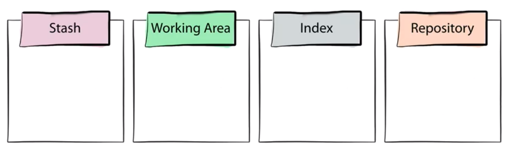

# Mastering Git
Course notes from PluralSight  
Start date: Jul 28th 2019

<!-- TOC -->

- [Mastering Git](#mastering-git)
- [Introduction](#introduction)
    - [The Four Areas](#the-four-areas)
        - [The Two Questions:](#the-two-questions)
    - [The Working Area](#the-working-area)
    - [The Repository](#the-repository)
    - [The Index](#the-index)
- [Basic Workflow](#basic-workflow)
    - [Removing files from git](#removing-files-from-git)
    - [Renaming files](#renaming-files)
- [git reset](#git-reset)
    - [Use cases](#use-cases)
- [More tools](#more-tools)
    - [The Stash Area](#the-stash-area)
    - [Solving conflicts](#solving-conflicts)
    - [Paths](#paths)

<!-- /TOC -->

# Introduction
* The Four Areas where git moves data in/out.
* Focus on *The Way Git Thinks*.
* This training is about how git cooks the onion from the previous training.
* The command line is your friend! :)

## The Four Areas
1. Stash
1. Working Area
1. Index (where you place your files before commiting)
1. Repository

### The Two Questions:
1. How does this command move information across the 4 areas?
1. How does this command change the repository?

## The Working Area
* The project directory in your file system.
* It is only important to you, not Git.

## The Repository
* It is in the `.git` folder.
* The objects folder.
* Commits may share the same objects.
* Each commit is like a snapshot in time.
* A *branch* is a reference to a *commit*.
* The can be only one *HEAD* which points to a commit (headless) or branch.
* Garbage collection when commits cannot be referenced by any branch.
* Note that this repository is **not the remote**.

## The Index
* Unique to Git.
* Aka the *staging area*.
* YOu can modify it directly.
* clean status: working area and *the current commit* in the repository are in sync.
* the index is like a launchpad.
* when you get the *nothing to commit, working area clean* message, it's actually a statement that the index and the working area contain the same data.
* `git diff`compares working area with index.
* `git diff --cache`compares index with repository.

# Basic Workflow
* The regular flow is to:
    1. change file (working area)
    1. stage (index)
    1. commit (repository)
* The *checkout* command moves from the *repository* to the *working area* and the *index*.

## Removing files from git
* `git rm` without options removes a file from the *working area* and the *index*.
* `git rm <file> --cached` removes from the index and keeps the file in the working area.
* `git rm` is not the opposite of `git add`!

## Renaming files
* git automatically finds out when you change a filename using your filesystem and commit it after staging.
* `git mv file1 file2` automatically renames the file and adds it to both the *working area* and the *index*. It's like a rename followed by a `git add`.

# git reset
*"git reset moves the current branch and optionally copies data from the Repository to the other areas."*

* To understand reset you need to understand the 3 main areas and git branches.
* it can do different things in different contexts.
* Commands that move branches implicitly (as consequence):
    - commit
    - merge
    - rebase
    - pull
* `git reset <commit id>` explicitly moves a branch! That's it!
* HEAD follows along.
* Options:
    * `--hard`: data is copied from repository to *index* AND *working area*.
    * `--mixed`: (default) data is copied from repository to *index* only.
    * `--soft`: branch is moved (points to a new commit) only in the *repository*.

## Use cases
1. revert changes from a branch to a previous commit. Example from the course: the *strawberry squid* dish. `git reset --hard <commit id>`. Previous commit get garbage collected. Q: Is there a way to force garbage collection? Should I worry that I commit secrets to a remote if I apply reset?
2. You regret a stage. After doing a git add, you regret it, so you wanted to revert *index* to match *repository*. Do a `git reset --mixed HEAD`. The first step of reset is actually nothing since HEAD in the *repository* already is pointing to the commit you want to go to. 
3. `git reset --hard HEAD` would reset everything, in the *working area* and *index* to whatever is in the repository.

# More tools
## The Stash Area
A clipboard for your project

* There is only one command that changes the stash is `git stash`.
* Data in there doesn't change unless you really want to. It's all yours!
* `git stash --include-untracked`
    * copies everyting from the working area that is not in the index or the repository, even untracked files, to the stash.
    * then it also checks out the current commit (from the repo).
    * you're in the clean state again.
* Like a clipboard.
* When you're done, restore with: `git stash apply stash@{0}` or simply `git stash apply`.
* then `git stash list`, `git stash clear`.

## Solving conflicts
* .git is altered in the middle of a merge command. This is how `git status` can list you all the conflicts.
* once conflict is solved (by editing the file) you "tell" git about it by adding the changed file to the index (staging). Then commit it.

## Paths
* `git checkout HEAD <somefile>`: copies somefile from the repo and overwrites it in the index and the working area.
