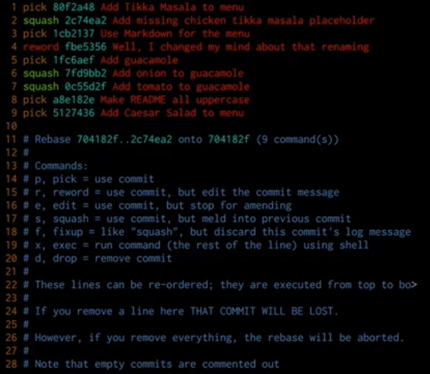

# Mastering Git
Course notes from PluralSight  
Start date: Jul 28th 2019

<!-- TOC -->

- [Mastering Git](#mastering-git)
- [Introduction](#introduction)
    - [The Four Areas](#the-four-areas)
        - [The Two Questions:](#the-two-questions)
    - [The Working Area](#the-working-area)
    - [The Repository](#the-repository)
    - [The Index](#the-index)
- [Basic Workflow](#basic-workflow)
    - [Removing files from git](#removing-files-from-git)
    - [Renaming files](#renaming-files)
- [git reset](#git-reset)
    - [Use cases](#use-cases)
- [More tools](#more-tools)
    - [The Stash Area](#the-stash-area)
    - [Solving conflicts](#solving-conflicts)
    - [Paths](#paths)
- [History Exploring the Past](#history-exploring-the-past)
    - [Commits by other names](#commits-by-other-names)
    - [History Forensics](#history-forensics)
    - [Git log](#git-log)
- [History Fixing Mistakes](#history-fixing-mistakes)
    - [Fixing the latest commit](#fixing-the-latest-commit)
    - [Interactive Rebases](#interactive-rebases)
    - [The Reflog](#the-reflog)
    - [Reverting commits](#reverting-commits)
- [Find your flow](#find-your-flow)
    - [Distribution Models](#distribution-models)
    - [Branching Models](#branching-models)
    - [Constraints](#constraints)
    - [A Simple Staring Workflow](#a-simple-staring-workflow)

<!-- /TOC -->

# Introduction
* The Four Areas where git moves data in/out.
* Focus on *The Way Git Thinks*.
* This training is about how git cooks the onion from the previous training.
* The command line is your friend! :)

## The Four Areas
1. Stash
1. Working Area
1. Index (where you place your files before commiting)
1. Repository

### The Two Questions:
1. How does this command move information across the 4 areas?
1. How does this command change the repository?

## The Working Area
* The project directory in your file system.
* It is only important to you, not Git.

## The Repository
* It is in the `.git` folder.
* The objects folder.
* Commits may share the same objects.
* Each commit is like a snapshot in time.
* A *branch* is a reference to a *commit*.
* The can be only one *HEAD* which points to a commit (headless) or branch.
* Garbage collection when commits cannot be referenced by any branch.
* Note that this repository is **not the remote**.

## The Index
* Unique to Git.
* Aka the *staging area*.
* YOu can modify it directly.
* clean status: working area and *the current commit* in the repository are in sync.
* the index is like a launchpad.
* when you get the *nothing to commit, working area clean* message, it's actually a statement that the index and the working area contain the same data.
* `git diff`compares working area with index.
* `git diff --cache`compares index with repository.

# Basic Workflow
* The regular flow is to:
    1. change file (working area)
    1. stage (index)
    1. commit (repository)
* The *checkout* command moves from the *repository* to the *working area* and the *index*.

## Removing files from git
* `git rm` without options removes a file from the *working area* and the *index*.
* `git rm <file> --cached` removes from the index and keeps the file in the working area.
* `git rm` is not the opposite of `git add`!

## Renaming files
* git automatically finds out when you change a filename using your filesystem and commit it after staging.
* `git mv file1 file2` automatically renames the file and adds it to both the *working area* and the *index*. It's like a rename followed by a `git add`.

# git reset
*"git reset moves the current branch and optionally copies data from the Repository to the other areas."*

* To understand reset you need to understand the 3 main areas and git branches.
* it can do different things in different contexts.
* Commands that move branches implicitly (as consequence):
    - commit
    - merge
    - rebase
    - pull
* `git reset <commit id>` explicitly moves a branch! That's it!
* HEAD follows along.
* Options:
    * `--hard`: data is copied from repository to *index* AND *working area*.
    * `--mixed`: (default) data is copied from repository to *index* only.
    * `--soft`: branch is moved (points to a new commit) only in the *repository*.

## Use cases
1. revert changes from a branch to a previous commit. Example from the course: the *strawberry squid* dish. `git reset --hard <commit id>`. Previous commit get garbage collected. Q: Is there a way to force garbage collection? Should I worry that I commit secrets to a remote if I apply reset?
2. You regret a stage. After doing a git add, you regret it, so you wanted to revert *index* to match *repository*. Do a `git reset --mixed HEAD`. The first step of reset is actually nothing since HEAD in the *repository* already is pointing to the commit you want to go to. 
3. `git reset --hard HEAD` would reset everything, in the *working area* and *index* to whatever is in the repository.

# More tools
## The Stash Area
A clipboard for your project

* There is only one command that changes the stash is `git stash`.
* Data in there doesn't change unless you really want to. It's all yours!
* `git stash --include-untracked`
    * copies everyting from the working area that is not in the index or the repository, even untracked files, to the stash.
    * then it also checks out the current commit (from the repo).
    * you're in the clean state again.
* Like a clipboard.
* When you're done, restore with: `git stash apply stash@{0}` or simply `git stash apply`.
* then `git stash list`, `git stash clear`.

## Solving conflicts
* .git is altered in the middle of a merge command. This is how `git status` can list you all the conflicts.
* once conflict is solved (by editing the file) you "tell" git about it by adding the changed file to the index (staging). Then commit it.

## Paths
* `git checkout HEAD <somefile>`: copies somefile from the repo and overwrites it in the index and the working area.

# History Exploring the Past
* Using VIM is like being a text surgeon.

## Commits by other names
* The default `git log` is not very friendly, so `git log --graph --decorate --oneline`.
* `git show HEAD^`: show me the parent commit of where HEAD is at now.
* `git show HEAD^^`: show me the grandpa of the commit where HEAD is at now.
* `git show HEAD~2`: same as above, going back 2 times. You can go back as many times as you like.
* if you're looking at a merge (2 parents): `git show HEAD~2^2` selects the 2nd parent after going back 2 commits in time.

## History Forensics
* `git blame <filename>` allows tracking who changed what when.
* `git diff HEAD HEAD~2` compare current commit with the one 2 commits ago.

## Git log
* `git help log`
* `git log --patch`: see which changes were introduced (patch)
* `git log --grep apples --oneline`: filter commits with the word "apples"
* `git log -Gapples --patch`: see commits that either added or deleted the word "apples".
* `git log HEAD~5..HEAD^`: list logs from 5 commits ago until the parent of HEAD.
* `git log dev..master --oneline`: shows all the commits from dev to master. All the ones missing from master.

# History Fixing Mistakes
**The Golden Rule: never change shared history!**

## Fixing the latest commit
Situation 1: You want to append changes you forgot in the previous commit.
* `git commmit --ammend`
* It really does look like a `git reset` to the previous commit.
* Older commit gets garbage collected.

## Interactive Rebases
Situation 2: You wan to squash one commit from today with one from the past, a few commits ago. In the example from the course, Paolo wanted to add the corresponding recipy from Chiken Masala together with the commit that added it to the menu.
* `git rebase` evolved to mean *change history*.
* `git rebase --interactive origin/master || commit-id`
* It is like writting a program to change history.

* If process is halted to solve a conflict, simply edit the files, save them, `git add` them to the index (to tell git the conflict is solved) and do `git rebase --continue`.
* The standard flow on git can be:
    - commit all the time without much care for the message.
    - rebase everything so that history looks nicer with an *interactive rebase*.
    - `git push` once after that.

## The Reflog
A way to get to orphan commits. :)
* `git reflog HEAD`
* `git show HEAD{@15}`
* `git reflog refs/head/master`

## Reverting commits
* `git revert [commit-id]`
* It is about git creating a new commit with changes that are the exact opposite of the given commit.
* Be careful when reverting merge commits, it is not an *undo*.

# Find your flow

## Distribution Models
* Peer-to-peer
* Centralized Model: the "blessed" repo.
* Pull Request (PR) Model: maintainers and contributors.
* Dictator and Lieutenants Model: main project and subprojects using the PR model. E.g.: Linux kernel.

## Branching Models
* Integration branch: aka master branch. Good practice is to keep it stable.
* Release branch: somethings multiple release branches.
* Feature branches: aka topic branches.
* `cherry-pick` is like a rebase of a single commit. You use it to copy a commit from one branch to another. Alternetively you can add the shared commit to another branch and merge it to the 2 branches.

## Constraints
* merge, don't rebase / rebase, don't merge.
* only developer X can do Y to branch Z.
* Don't push to a red build.
* Squash a feature before merging to master.

## A Simple Staring Workflow
Grow your flow, do not start overly complex.

> "Simple, clear purpose and principles give rise to complex and intelligent behavior.  
> Complex rules and regulations give rise to simple and stupid behavior."  
> Dee Hock

Distribution model  
- centralized

Branching model
- one integration branch (master)
- one feature branch per feature

Contraints
- Keel master stable and fix it ASAP if broken
- integrate feature branches every few days (to avoid merge hell)
- use merge over rebase by default
